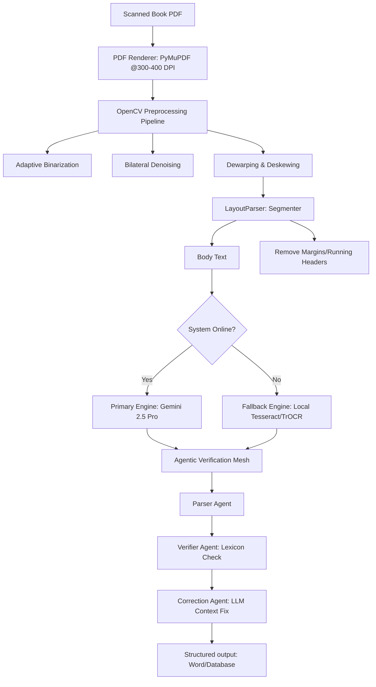

# Technical Architecture Design: Historical Bengali Book OCR & Archival Search System
## Specially Designed for 19th-Century Academic Research (1850s Literature)

---

## 1. Executive Summary

Digitizing Bengali literature from the **1850s** presents unique orthographic and material challenges. Prior to Ishwar Chandra Vidyasagar’s typographical reforms in the mid-1850s, Bengali printing houses used highly complex, stacked consonant conjuncts (যুক্তাক্ষর), irregular line spacings, and inconsistent ligatures. Additionally, historical paper suffers from degradation (foxing, yellowing, ink bleed-through).

This document outlines a production-ready **Intelligent Document Processing (IDP) and Search Architecture** designed for university professors and research students. It achieves maximum accuracy by combining state-of-the-art multimodal Large Language Models (LLMs) with a robust local fallback system, an agentic verification mesh, and an accessible UI/UX tailored for older academic professionals.

---

## 2. Technical Stack Selection

To handle heavy document conversion, vector search, and a native desktop experience, we recommend a **hybrid local-client architecture**:

*   **UI Shell**: **Electron (HTML5/CSS3/JavaScript/TypeScript)**
    *   *Why*: Allows pixel-perfect typography control, accessibility adjustments, and stable multi-platform rendering (Windows/macOS). It provides native file dialogues that older users expect.
*   **Local Backend**: **Python (Flask or FastAPI) child process**
    *   *Why*: Python is the industry standard for computer vision (OpenCV) and machine learning. Running it as a background service prevents the UI from freezing during long OCR tasks.
*   **OCR Engines**: 
    *   *Primary (Cloud)*: **Gemini 2.5 Pro / 1.5 Pro API** (Vertex AI / Google AI Studio) with high-resolution image reasoning.
    *   *Alternative (Local / Open-Source)*: **Qwen2.5-VL** or a fine-tuned **TrOCR (Vision-Encoder-Decoder)** model.
    *   *Fallback (Offline)*: **Tesseract OCR v5** with a custom-trained Bengali LSTM language model.
*   **Database & Search**: **ChromaDB (Local Vector DB)** combined with **SQLite** for document metadata.

---

## 3. High-Accuracy Text Extraction Pipeline (The Engine)

Standard OCR systems will fail on 1850s print due to paper damage and archaic scripts. The pipeline below corrects these issues at each stage:



### A. OpenCV Image Preprocessing
*   **Bilateral Denoising**: Removes speckling, dirt, and mold (foxing) while preserving sharp edges of text strokes.
*   **Sauvola Local Adaptive Thresholding**: Binarizes the page dynamically. This is crucial for historical books where paper color varies from dark brown to light yellow.
*   **Dewarping (Perspective Correction)**: Corrects page curvature caused by scanning books without flattening the bindings.

### B. Deep Learning Layout Analysis
Using **LayoutParser** (with a MobileNet or ResNet backbone) to detect page boundaries and segment structural zones.
*   Extracts only the body text block.
*   Discards page numbers, running titles (book titles at the top), and decorative border art, preventing them from corrupting the core text database.

### C. The Dual-OCR Core
1.  **Gemini 2.5 Pro / 1.5 Pro (Primary)**:
    *   Processed at **High Resolution** (`media_resolution_high` config). This ensures that vowel modifiers (e.g., *e-kar* and *o-kar*) and complex ligatures are not misread.
    *   *System Prompting*: We instruct the model to act as a paleographer specialized in 19th-century Bengali text. We explicitly tell it to preserve archaic spelling conventions and stacked glyph layouts instead of auto-correcting them into modern Bengali.
2.  **Tesseract v5 LSTM (Fallback)**:
    *   We utilize a custom language pack trained specifically on a corpus of 19th-century Bengali prints.
    *   *Page Segmentation Mode*: Force `--psm 3` (fully automatic page segmentation) or `--psm 6` (assume a single uniform block of text).

### D. Agentic Verification & Correction Mesh
Instead of trusting a single OCR output, the system runs an **Agentic Mesh** using lightweight local or cloud language models:
*   **Parser Agent**: Extracts the raw characters from the OCR engine.
*   **Verifier Agent**: Compares extracted words against a specialized historical Bengali dictionary (incorporating Sadhu Bhasha *সাধুভাষা* and 19th-century spellings). It flags low-confidence words.
*   **Correction Agent**: Uses surrounding paragraph context to resolve spelling anomalies (e.g., determining whether a blurred character is a "t" or a "d" based on sentence semantics).

---

## 4. Archival Retrieval & Semantic Search (The RAG Pipeline)

For research, professors need to search concepts, not just exact strings.

1.  **Semantic Chunking**: Split the book text by paragraph, preserving the page numbers as metadata citations.
2.  **Vector Embeddings**: Generate vectors using `text-embedding-004` (Google) or `all-MiniLM-L6-v2` (Local).
3.  **Vector Database**: Store embeddings in **ChromaDB**.
4.  **Clickable Citations**: When the professor queries the database (e.g., "১৮৫২ সালের নীল চাষের বিবরণ" / "Account of indigo cultivation in 1852"), the search results present:
    *   The extracted text answer.
    *   A deep-link citation. Clicking the citation displays a popup showing the **original scanned PDF page with the matching passage highlighted**.

---

## 5. UI/UX Design for Older Professors

Academic professionals doing historical research require a highly accessible, low-cognitive-load design:

```
+-------------------------------------------------------------------------+
|  [Select Book]  [Search Archive]  [Settings]                 User: Prof |
+-------------------------------------------------------------------------+
|                                  |                                      |
|                                  |   PAGE 24 (TRANSCRIPTION)  [Save]    |
|       ORIGINAL BOOK SCAN         |                                      |
|                                  |   ১৮৫২ সালের জুন মাসের ৪ঠা...        |
|   +--------------------------+   |   [  নীল চাষীদের ওপর যে অত্যাচার ]   |
|   |                          |   |   [  করা হইয়াছিল তাহা...        ]   |
|   |  ১৮৫২ সালের জুন মাসের... |   |                                      |
|   |                          |   |   --------------------------------   |
|   |  নীল চাষীদের ওপর যে...   |   |   Archaic Word Flagged: "অত্যাচার"   |
|   |                          |   |   [Accept] [Ignore] [Edit manually]  |
|   +--------------------------+   |                                      |
|                                  |                                      |
+-------------------------------------------------------------------------+
|  <- Previous Page  [ Page 24 of 180 ]  Next Page ->      Progress: 15% |
+-------------------------------------------------------------------------+
```

### Key UI/UX Principles:
*   **Comfortable Typography**:
    *   Use large, easily readable traditional Bengali serif fonts (e.g., **SolaimanLipi** or **Kalpurush**) which mimic printed book faces.
    *   Body text size must default to **18px** with generous line spacing (1.6x).
*   **High-Contrast, Low-Strain Color Palette**:
    *   Use a book-like theme: off-white/cream backgrounds (`#FDFBF7`) with charcoal text (`#2A2A2A`) to reduce glare and eye strain.
*   **Minimalist Split-Screen Workspace**:
    *   Left side: Scanned PDF page (fully zoomable using scroll-wheel).
    *   Right side: Extracted editable text.
    *   This side-by-side view allows professors to verify OCR accuracy against the original print quickly.
*   **No Hidden Controls**:
    *   Avoid hamburger menus, nested folders, or complex touch gestures.
    *   All key buttons (e.g., "Save Word Document", "Next Page", "Print") must have large, explicit text labels in Bengali (e.g., **"ডকুমেন্ট সংরক্ষণ করুন"** instead of a simple disk icon).
*   **Accidental Mistake Recovery**:
    *   Include a prominent, global "Undo" (পূর্বাবস্থায় ফিরুন) button for editing text.
    *   Confirm all destructive operations (e.g., deleting a book from the archive) with a large, readable dialog popup.

---

## 6. Fallback and Error Resilience

To keep the application production-ready, we build in programmatic resilience:

*   **Offline Mode**: If the laptop loses internet, the system automatically swaps from Gemini API to the local Tesseract OCR engine. A subtle message informs the user: *"Offline mode active: Using local engine (reduced accuracy)."*
*   **Rate-Limit Management (Cloud API)**:
    *   Requests are throttled to **12 requests/minute** (safe under the 15 RPM limit).
    *   If a `429 (Too Many Requests)` error is received, the backend pauses, waits 10 seconds, and retries using exponential backoff.
*   **Incremental Autosave**: The app autosaves the transcriptions to a local SQLite database and updates the Word file after each page, preventing loss of work during power cuts or crashes.
