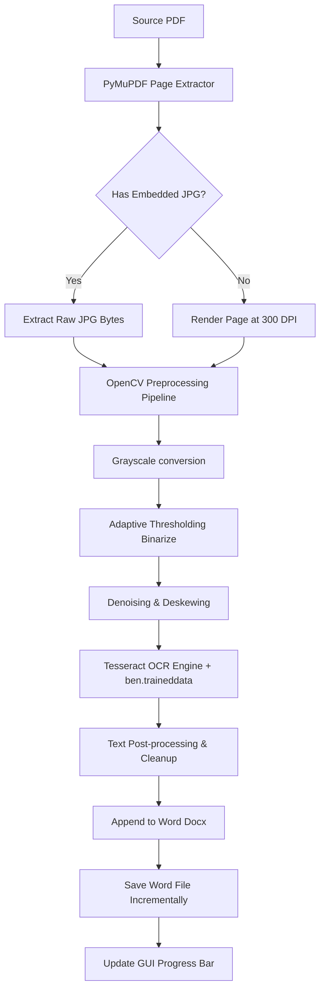

# Scope, Challenges, and Free-of-Cost Implementation Plan

This document provides a deep-dive analysis of the proposed plan in [ex_plan.txt](file:///f:/Programing%20Project/CLI/PDF%20text%20ectractor/ex_plan.txt). It highlights the project's scope, examines the primary technical challenges (specifically for Bengali OCR and large PDF rendering), and presents a robust, free-of-cost engineering solution using an open-source python-based stack.

---

## 1. Project Scope

The goal of the application is to extract Bengali text from image-based/scanned PDF files (often created by merging multiple JPG images) and output it formatted into a Microsoft Word (`.docx`) file resembling a book. 

### Core Features
*   **Input Support**: Heavy, multi-page PDFs containing embedded JPGs or flat-scanned pages.
*   **Target Language**: Bengali (Bangla) script, which requires specialized layout analysis and character mapping.
*   **Target Output**: Structured MS Word (`.docx`) documents written sequentially (line-by-line) to mimic a book layout.
*   **User Interface**: A clean, modern desktop GUI running locally on Windows laptops.
*   **Commercial Constraint**: **100% Free of Cost** (no paid Google Cloud Vision, Azure Read, or OpenAI APIs; all computations must run locally on the user's laptop).

---

## 2. Key Technical Challenges

Creating a high-performance local OCR tool for Bengali is significantly more complex than standard English OCR. Below are the primary bottlenecks and how to solve them:

### Challenge A: Bengali OCR Accuracy in Tesseract
*   **Problem**: Bengali is a cursive script with a top horizontal connecting line (matra *মাত্রা*), complex conjunct characters (juktakhon *যুক্তাক্ষর*), and vowel modifiers (kar *কার*) that attach above, below, or to either side of a character. Default Tesseract configurations frequently misread low-contrast, skewed, or blurred scanned pages, producing "garbage text" or missing characters.
*   **Impact**: Output documents containing highly distorted or unreadable text.

### Challenge B: Memory Management with Large PDFs
*   **Problem**: Converting multiple pages of high-resolution images or rendering 300 DPI canvases in memory simultaneously can easily crash a standard laptop's RAM (causing `MemoryError` or system slowdowns).
*   **Impact**: App crash when processing books with 100+ pages.

### Challenge C: Portable Packaging (Self-Contained Installer)
*   **Problem**: Python programs require a local Python installation and external library dependencies. Crucially, Tesseract OCR is not a Python library—it is a separate C++ command-line application that must be installed on Windows and added to the System PATH. Non-technical users will struggle to install this manually.
*   **Impact**: High friction for distribution and setup.

### Challenge D: GUI Threading & Window Freezing
*   **Problem**: OCR is a CPU-intensive operation. Running a 100-page OCR task directly in the main GUI loop will make Windows flag the app as "Not Responding", freezing the window and preventing progress bar updates.
*   **Impact**: Poor user experience; user might force-quit the application thinking it crashed.

### Challenge E: Noise Filtering & Text Cleanup
*   **Problem**: Scanned images often contain dark margins, gutter lines (from book bindings), or specks of dust. Tesseract tries to interpret these as characters, adding random punctuation marks (`.` `,` `~` `|` `[` `_`) into the middle of Bengali sentences.
*   **Impact**: Extra effort for the user to clean up the Word document after extraction.

---

## 3. Recommended Free-of-Cost Technical Plan

To build a fully free, high-performance solution, we recommend the following local pipeline:



### Actionable Technical Steps

#### 1. Implement a Preprocessing Pipeline (OpenCV)
Before sending the image to Tesseract, your developer should apply simple image filters using `opencv-python`. This boosts Bengali OCR accuracy by up to 30-40%:
*   **Binarization (Adaptive Thresholding)**: Converts grays/shadows to pure black text on a pure white background.
*   **Dilation/Erosion**: Thickens faded font lines to make matras (connecting lines) solid.
*   **Deskewing**: Rotates slightly tilted scans to keep text lines perfectly horizontal, which is vital for Tesseract's page segmentation modes.

#### 2. Implement Incremental File Writing & GC
Instead of holding all extracted text in a python string, the app should save to the `.docx` document and flush to disk after *every single page*.
*   Call `fitz` garbage collector `fitz.tools.shrink_memory_meta()` after every page.
*   Explicitly delete large `PIL.Image` or `numpy` arrays and invoke python's `gc.collect()`.

#### 3. Run OCR inside a Worker Thread (or Process Pool)
*   Use `threading.Thread` or `concurrent.futures.ThreadPoolExecutor` to run the OCR extraction.
*   Use thread-safe GUI queues or CustomTkinter variables to send progress updates (e.g., "Page 15 of 120 completed") to the main thread.

#### 4. Bundle Tesseract inside the App Executable
*   Use **PyInstaller** with the `--add-data` flag.
*   Include the Tesseract Windows binaries (a mini Tesseract folder containing `tesseract.exe` and `tessdata/ben.traineddata`) directly in the app source folder.
*   In the Python code, resolve the Tesseract executable path dynamically at runtime relative to the execution directory:
    ```python
    import os
    import sys

    def get_tesseract_path():
        if getattr(sys, 'frozen', False):
            # Running inside PyInstaller Bundle
            base_path = sys._MEIPASS
        else:
            base_path = os.path.dirname(os.path.abspath(__file__))
        return os.path.join(base_path, 'Tesseract-OCR', 'tesseract.exe')
    ```
    This eliminates the need for the user to download Tesseract separately. The app becomes a simple double-click launch.

---

## 4. Enhanced Python Skeleton Code

Below is an improved Python implementation containing the image preprocessing pipeline, progress signaling, and robust resource management. Your developer can use this directly.

```python
import os
import io
import gc
import sys
import threading
import fitz  # PyMuPDF
import cv2  # OpenCV
import numpy as np
from PIL import Image
import pytesseract
from docx import Document

class BengaliOcrEngine:
    def __init__(self, tesseract_cmd_path=None):
        # Configure Tesseract path (defaults to a bundled folder or system fallback)
        if tesseract_cmd_path:
            pytesseract.pytesseract.tesseract_cmd = tesseract_cmd_path
        else:
            # Automatic path resolution for packaged app
            if getattr(sys, 'frozen', False):
                base_path = sys._MEIPASS
            else:
                base_path = os.path.dirname(os.path.abspath(__file__))
            pytesseract.pytesseract.tesseract_cmd = os.path.join(base_path, "Tesseract-OCR", "tesseract.exe")

    def preprocess_image(self, pil_image):
        """
        Denoises and binarizes the image to maximize OCR accuracy for Bengali script.
        """
        # Convert PIL Image to OpenCV BGR format
        open_cv_image = cv2.cvtColor(np.array(pil_image), cv2.COLOR_RGB2BGR)
        
        # 1. Convert to Grayscale
        gray = cv2.cvtColor(open_cv_image, cv2.COLOR_BGR2GRAY)
        
        # 2. Apply Adaptive Thresholding (turns shadows/gray backgrounds to pure white)
        binarized = cv2.adaptiveThreshold(
            gray, 255, cv2.ADAPTIVE_THRESH_GAUSSIAN_C, cv2.THRESH_BINARY, 11, 2
        )
        
        # 3. Median Blur to denoise small specks
        denoised = cv2.medianBlur(binarized, 3)
        
        # Convert back to PIL Image
        return Image.fromarray(denoised)

    def clean_text(self, text):
        """
        Cleans up common Tesseract noise artifacts (lone English symbols in Bengali text).
        """
        lines = text.split('\n')
        cleaned_lines = []
        for line in lines:
            stripped = line.strip()
            if not stripped:
                continue
            # Optionally implement regex to filter out isolated noise characters e.g. [, ], ~, _
            # for now, we perform a simple strip and sanity length filter
            cleaned_lines.append(stripped)
        return cleaned_lines

    def process_pdf(self, pdf_path, output_docx_path, progress_callback=None):
        """
        Extracts text page-by-page, processes it, and writes incrementally to a Word file.
        """
        doc = Document()
        doc.add_heading("Extracted Bengali Book", level=0)
        
        pdf_file = fitz.open(pdf_path)
        total_pages = len(pdf_file)
        
        try:
            for page_index in range(total_pages):
                page = pdf_file[page_index]
                image_list = page.get_images(full=True)
                
                page_paragraphs = []
                
                if image_list:
                    # Case A: Embedded image extraction
                    for img_info in image_list:
                        xref = img_info[0]
                        raw_image_data = pdf_file.extract_image(xref)
                        image_bytes = raw_image_data["image"]
                        
                        # Open PIL Image from bytes
                        pil_img = Image.open(io.BytesIO(image_bytes))
                        
                        # Preprocess
                        processed_img = self.preprocess_image(pil_img)
                        
                        # OCR with Bengali language
                        raw_text = pytesseract.image_to_string(
                            processed_img, 
                            lang="ben", 
                            config="--psm 3"  # Fully automatic page segmentation
                        )
                        
                        page_paragraphs.extend(self.clean_text(raw_text))
                else:
                    # Case B: Fallback - Scan render (300 DPI)
                    pixmap = page.get_pixmap(dpi=300)
                    image_bytes = pixmap.tobytes("png")
                    pil_img = Image.open(io.BytesIO(image_bytes))
                    
                    processed_img = self.preprocess_image(pil_img)
                    raw_text = pytesseract.image_to_string(processed_img, lang="ben", config="--psm 3")
                    page_paragraphs.extend(self.clean_text(raw_text))

                # Append to Word file
                if page_paragraphs:
                    doc.add_paragraph(f"\n--- পৃষ্ঠা {page_index + 1} ---\n")
                    for paragraph in page_paragraphs:
                        doc.add_paragraph(paragraph)
                
                # Save incrementally to protect large data
                doc.save(output_docx_path)
                
                # Update UI Progress Bar
                if progress_callback:
                    progress_callback(page_index + 1, total_pages)
                
                # Memory Cleanup
                del page_paragraphs
                gc.collect()
                
        finally:
            pdf_file.close()
            # Fitz garbage collection
            fitz.tools.shrink_memory_meta()
            gc.collect()
